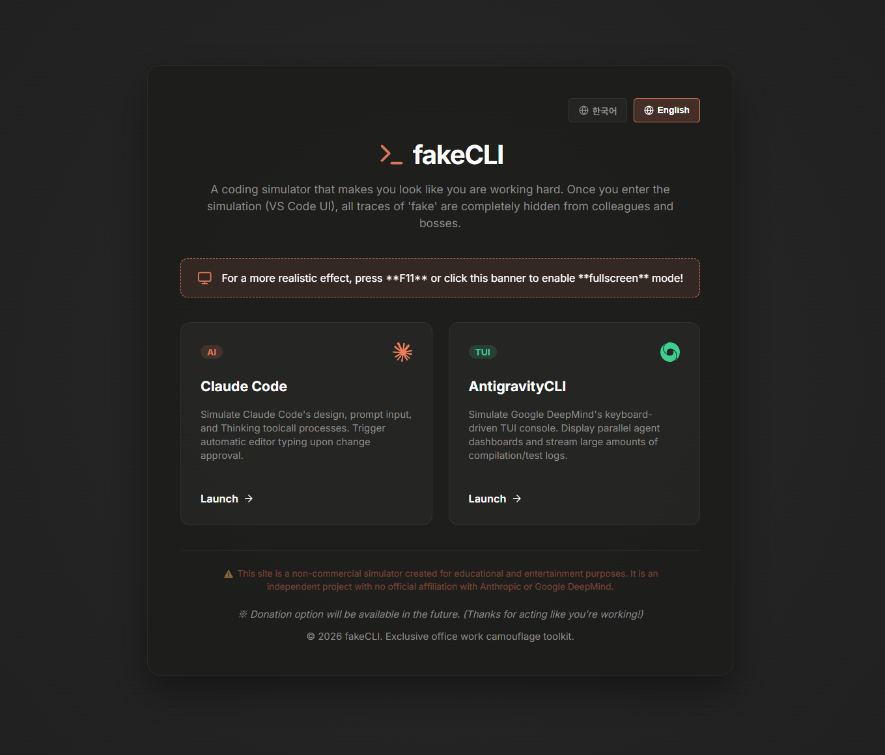
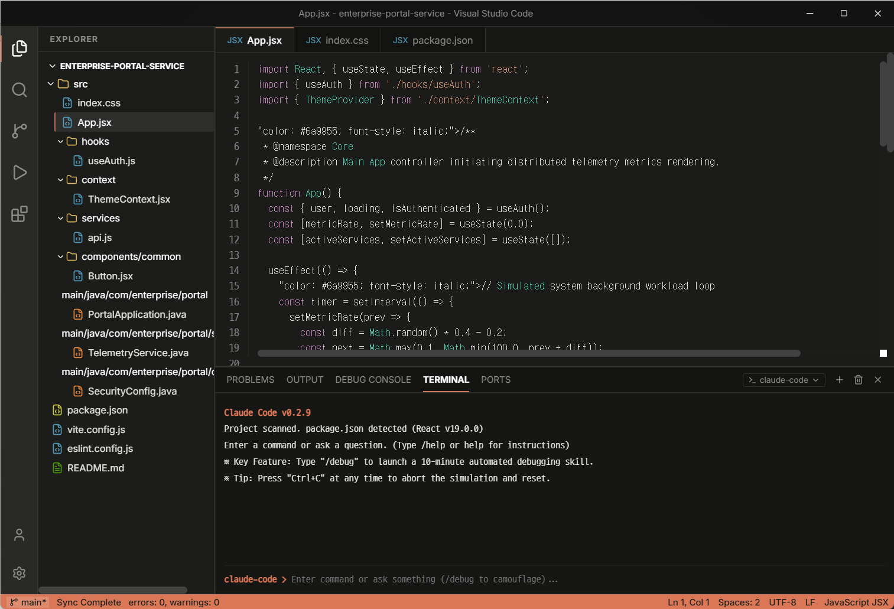

# fakeCLI - Work Camouflage Coding Simulator 💻🤫
### [업무 보안 위장용 코딩 시뮬레이터]

<p align="center">
  <a href="https://jjajjara.github.io/fakeCLI/">
    
  </a>
  
  
  
</p>

---

## 🌟 Introduction (소개)

**fakeCLI** is a humor-oriented web-based coding simulator designed for developers, engineers, and office workers. It simulates terminal-based AI coding agents (**Claude Code**, **ChatGPT / GPT CLI**, **Gemini**, and **Antigravity CLI** by Google DeepMind) to make you look incredibly busy and hard-working in public or office environments. Try the high-speed **Vibe Coding** simulator mode to instantly stream trace logs!

**fakeCLI**는 사무실이나 공공장소에서 주변의 눈치를 보지 않고 열심히 일하는 것처럼 위장(Camouflage)할 수 있는 유머 목적의 웹 코딩 시뮬레이터입니다. 최신 AI 코딩 에이전트(**Claude Code**, **ChatGPT / GPT**, **Gemini**, **Antigravity CLI**)의 터미널 UI 및 **Vibe Coding (바이브 코딩)** 모드의 폭풍 터미널 로그 스트리밍과 자동 소스 코드 타이핑 흐름을 실감 나게 구현하였습니다.

> 🔒 **Privacy Safeguard**: Once you click a mode and enter the main simulation (VS Code Layout UI), all references to the word "fake" or "simulation" are completely hidden from the screen, ensuring absolute camouflage.
> 
> 🔒 **보안 기능**: 인트로 화면을 지나 메인 시뮬레이터(VS Code 레이아웃)에 진입하면 화면의 모든 "fake" 또는 "시뮬레이션" 흔적이 사라져, 동료나 상사가 보아도 실제 에이전트를 가동 중인 것처럼 완벽히 위장됩니다.

---

## 🖥️ Screen Previews (화면 미리보기)

> [!TIP]
> *Add your screenshot files to the repository root directory as name `screenshot_intro.png` and `screenshot_main.png` to display here!*
> *아래 스크린샷 플레이스홀더를 사용자가 직접 스크린샷 파일을 찍어 루트 경로에 업로드함으로써 즉시 노출할 수 있습니다.*

| Intro Layout (인트로 모드 선택) | Simulator Layout (VS Code 시뮬레이터 메인) |
| --- | --- |
|  |  |

---

## 🚀 Live Demo (데모 사이트)
* **URL**: [https://jjajjara.github.io/fakeCLI/](https://jjajjara.github.io/fakeCLI/)
* For the best camouflage effect, press **F11** to toggle fullscreen mode!
* 더욱 완벽한 위장 효과를 위해 브라우저에서 **F11 키**를 눌러 전체화면 모드로 작동해 보세요!

---

## ✨ Core Features (주요 기능)

### 1. Claude Code Mode 🧡
* **Thinking Spinner**: Emulates the unique Anthropic-style ASCII box spinner (`╔══ ... ══╗`).
* **Interactive Toolcalls**: Generates mock approvals for tool executions (e.g., read_file, write_file).
* **Automatic Coding**: Simulates realistic typing animations in the editor file system once a tool task is approved.

### 2. Antigravity CLI Mode 💚
* **Google DeepMind TUI Style**: Features Google-style terminal ASCII art headers and green accent themes.
* **TUI Border Box**: Emulates agent tools with fine-line boxes (`┌── ... └──`).
* **Multi-agent Console**: Shows real-time simulated parallel subagent states on the panel side.

### 3. VIBE Coding Mode (폭풍 코딩 모드) 🔥
* Instantly starts massive, random coding streams directly into the editor.
* Designed to look like a high-speed, expert compilation workflow.
* Comes with a quick escape switch and realistic HMR (Hot Module Replacement) camouflage overlays.

---

## 🛠️ Usage & Commands (사용법 및 가상 명령어)

Once inside the terminal simulator, you can type the following commands to trigger actions:

### Core Simulator Commands
| Command (명령어) | Description (English) | 설명 (한국어) |
| --- | --- | --- |
| `help` or `/help` | Displays the interactive terminal guide. | 터미널 도움말 안내 표를 출력합니다. |
| `debug` | Starts an enterprise-level long-duration debugging sequence. | 7단계의 기업용 디버깅/빌드/테스트 시나리오를 시작합니다. |
| `ai [task]` | Triggers a simulated AI agent session (e.g., `ai dashboard`). | 가상의 AI 분석 분석 및 에디터 자동 수정을 진행합니다. |
| `vibe` | Enters high-speed "Vibe Coding" session. | 에디터 화면에 폭풍 코딩 시각화 효과를 시작합니다. |
| `clear` | Clears the mock terminal console. | 가상 터미널 로그를 깔끔하게 비웁니다. |

### Emergency Hotkeys (긴급 탈출 키)
* **Escape (ESC)** or **Ctrl + C**: 
  - Immediately aborts ongoing AI analysis, long debugging loops, or Vibe coding mode.
  - Instantly resets the console to standard standby mode to protect your work screen.
  - AI 분석 중, 디버깅 스케줄링 도중, 혹은 Vibe 코딩 중에 **ESC** 또는 **Ctrl + C**를 누르면 모든 시뮬레이션이 즉각 중단되고 대기 쉘로 안전하게 대피합니다.

---

## 📦 Setup & Installation (로컬 설치 및 구동)

If you wish to clone this project and run it locally:

### Prerequisites
* Node.js (v18+)
* npm (v9+)

### Installation
```bash
# Clone the repository
git clone https://github.com/jjajjara/fakeCLI.git
cd fakeCLI

# Install dependencies
npm install

# Run local development server
npm run dev

# Build production bundle
npm run build

# Deploy to GitHub Pages
npm run deploy
```

---

## ⚖️ Disclaimer (법적 면책 조항)

This website is a non-commercial, humor-driven simulator created solely for educational and entertainment purposes. It is an independent project and has no official affiliation, endorsement, or relationship with Anthropic (Claude Code) or Google DeepMind (Antigravity).

본 웹사이트는 학습 및 유머 목적으로 제작된 비상업적 시뮬레이터이며, Anthropic(Claude Code) 또는 Google DeepMind(Antigravity)와 어떠한 제휴나 공식적인 관계도 없는 개인의 유머/창작 프로젝트입니다.
